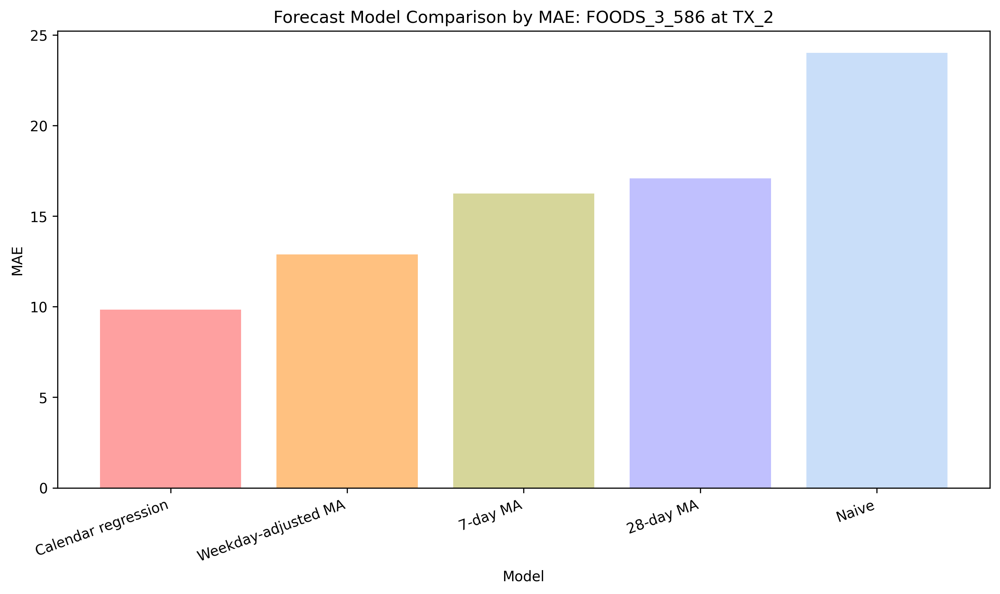
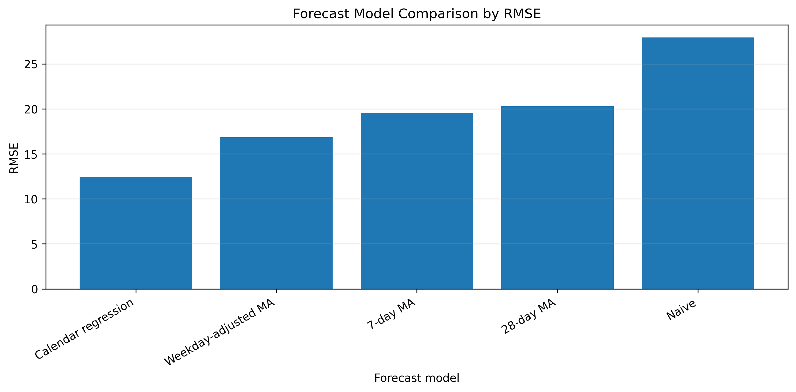
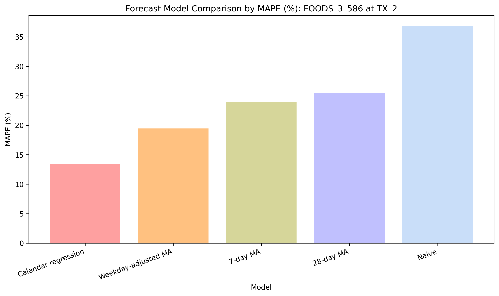
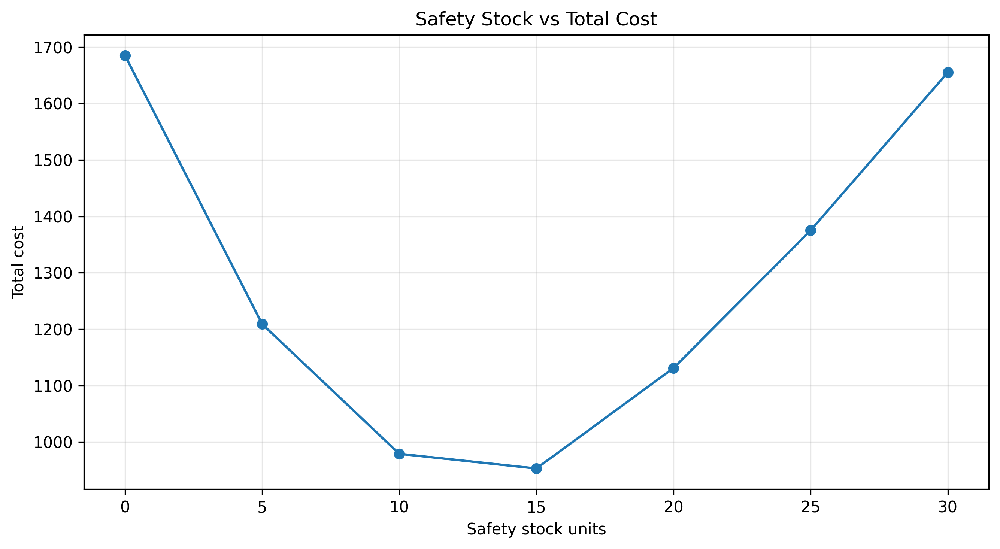
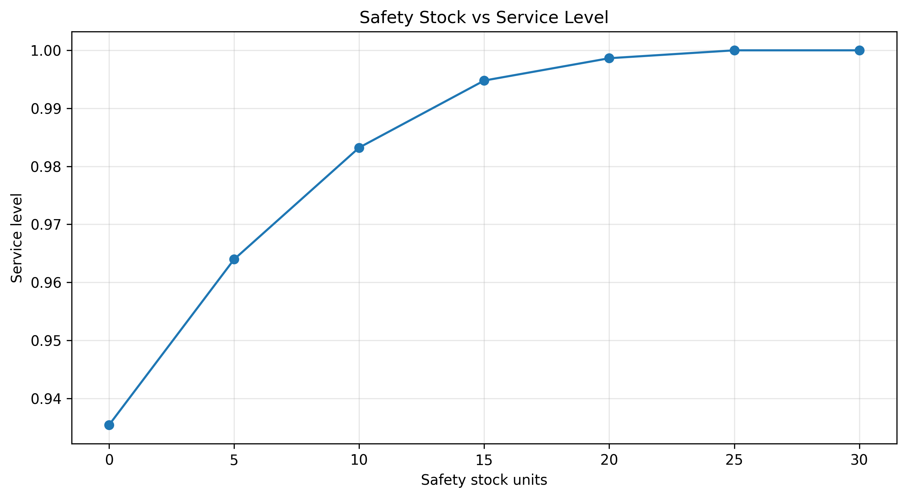
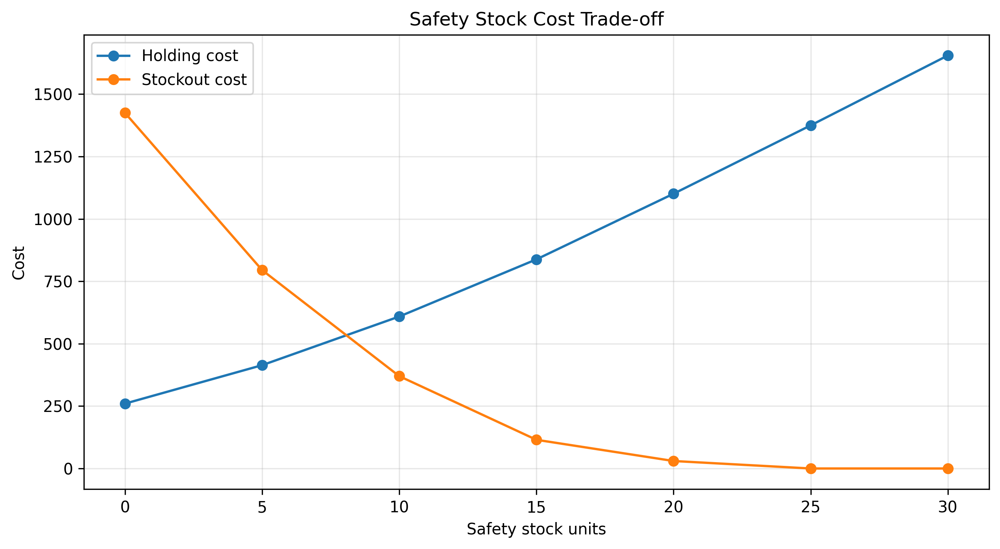
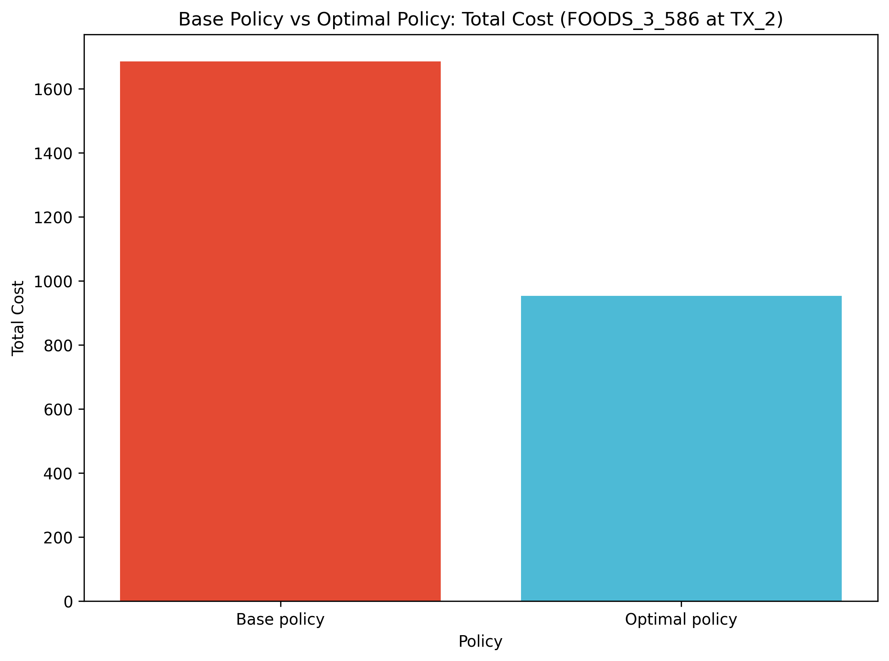
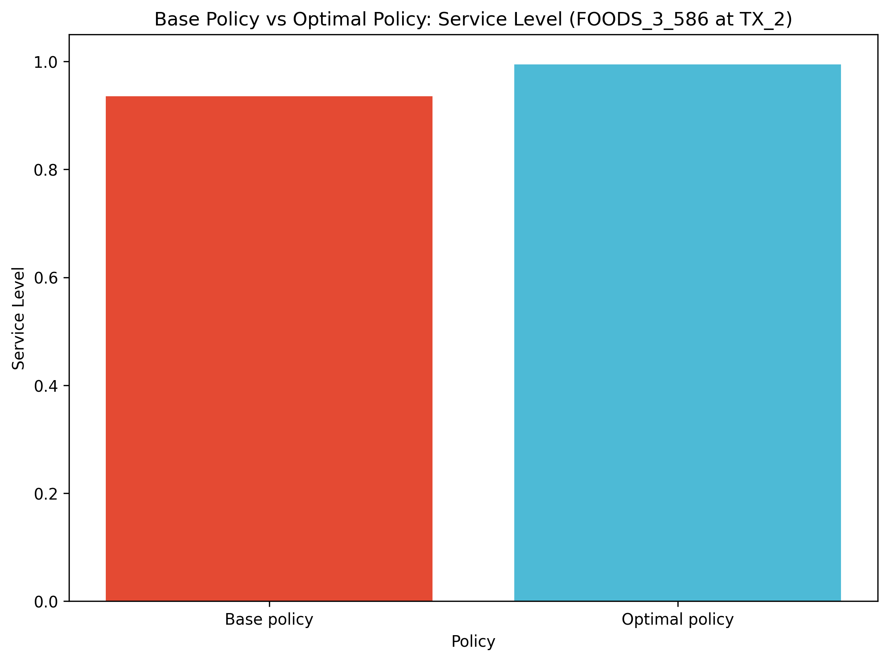

# Demand Forecasting and Inventory Policy Simulation

**[Download the final report (PDF)](final_report.pdf)**

## 1. Introduction

Demand uncertainty in supply chains can lead to excess inventory or stockouts. This project focuses on a practical operations problem: how to connect analytical results with inventory, logistics, and warehouse decisions. In this project, I connect demand forecasting with inventory replenishment decisions for a retail product-store combination. Using the M5 Forecasting dataset, I analyze the future demand of a high-demand product-store combination and compare different inventory simulation strategies to see which strategy can reduce the stockout rate and total inventory cost.

## 2. Research Question

Based on my previous data-driven predictive projects, I use forecasting and inventory simulation models in this portfolio to strengthen my analytical skills, from analyzing data to supporting operational decisions.
To achieve this, the core research question of this project is:
> How can demand forecasting be integrated with inventory policies to improve replenishment decisions under demand uncertainty?

The project follows an end-to-end operations analytics workflow:

1. Prepare item-store level daily demand data
2. Analyze demand patterns
3. Build and compare forecasting models
4. Select the best demand forecast
5. Simulate inventory replenishment policies
6. Recommend a safety stock level based on total cost and service level

## 3. Data

The project uses the M5 Forecasting dataset and focuses on one product-store combination.

- Selected item-store: **FOODS_3_586 at TX_2**
- Forecast horizon: **56 days**

The processed dataset contains daily demand, selling price, calendar variables, and revenue-related fields.

## 4. Methods

The methods include:
- Data preprocessing
- Forecasting models
- Inventory policy
- Cost simulation
- Evaluation metrics

I first convert the M5 wide table into a daily item-store time series. Then, I compare forecasting models using MAE, RMSE, and MAPE, and select calendar-feature linear regression as the optimal forecasting model. Afterwards, I use the 56-day daily demand forecasts generated by this model as the input for the inventory strategy simulation. Under the forecast-based order-up-to policy, the target inventory level for each day equals the forecasted demand plus safety stock. I then test different safety stock levels and find that the total cost is minimized when the safety stock level is 15.

## 5. Results

### 5.1 Forecasting Results

The following forecasting models were compared:

- Naive forecast
- 7-day moving average forecast
- 28-day moving average forecast
- Weekday-adjusted moving average forecast
- Calendar-feature linear regression forecast

The calendar-feature linear regression model used selling price, time trend, weekday indicators, and monthly indicators as forecasting features.

#### Forecasting model comparison

| model_short         |     MAE |    RMSE |   MAPE_percent |
|:--------------------|--------:|--------:|---------------:|
| Calendar regression |  9.8362 | 12.4503 |        13.4506 |
| Weekday-adjusted MA | 12.8884 | 16.8554 |        19.4382 |
| 7-day MA            | 16.2526 | 19.5498 |        23.897  |
| 28-day MA           | 17.0893 | 20.2939 |        25.3874 |
| Naive               | 24.0179 | 27.9595 |        36.7765 |

The best forecasting model was **Calendar-feature linear regression forecast**.

Key forecasting results:

- MAE: **9.84**
- RMSE: **12.45**
- MAPE: **13.45%**
- MAE reduction from naive baseline: **59.05%**

### 5.2 Inventory Policy Simulation Results

The selected forecast was used as an input to simulate forecast-based replenishment policies.

The simulation tested safety stock levels of 0, 5, 10, 15, 20, 25, and 30 units.

Each policy was evaluated using lost sales, service level, stockout days, holding cost, stockout cost, and total cost.

#### Safety stock policy comparison

|   safety_stock_units |   total_lost_sales |   service_level |   stockout_days |   total_holding_cost |   total_stockout_cost |   total_cost |
|---------------------:|-------------------:|----------------:|----------------:|---------------------:|----------------------:|-------------:|
|                    0 |                285 |        0.935418 |              30 |                  260 |                  1425 |         1685 |
|                    5 |                159 |        0.96397  |              22 |                  414 |                   795 |         1209 |
|                   10 |                 74 |        0.983231 |              13 |                  609 |                   370 |          979 |
|                   15 |                 23 |        0.994788 |               5 |                  838 |                   115 |          953 |
|                   20 |                  6 |        0.99864  |               2 |                 1101 |                    30 |         1131 |
|                   25 |                  0 |        1        |               0 |                 1375 |                     0 |         1375 |
|                   30 |                  0 |        1        |               0 |                 1655 |                     0 |         1655 |

### 5.3 Recommended Inventory Policy

The recommended safety stock level is **15 units**.

This policy achieved the lowest total cost among the tested safety stock levels.

#### Base policy vs optimal policy

| policy_type    |   safety_stock_units |   total_lost_sales |   service_level |   stockout_days |   average_ending_inventory |   total_holding_cost |   total_stockout_cost |   total_cost |
|:---------------|---------------------:|-------------------:|----------------:|----------------:|---------------------------:|---------------------:|----------------------:|-------------:|
| Base policy    |                    0 |                285 |        0.935418 |              30 |                    4.64286 |                  260 |                  1425 |         1685 |
| Optimal policy |                   15 |                 23 |        0.994788 |               5 |                   14.9643  |                  838 |                   115 |          953 |

Compared with the base policy without safety stock:

- Total cost decreased from **1685.0** to **953.0**
- Total cost reduction: **732.0**
- Total cost reduction percent: **43.44%**
- Service level improvement: **0.0594**
- Lost sales reduction: **262 units**

## 6. Discussion

By comparing the forecast metrics of different forecasting models, I found that calendar-feature linear regression improved forecasting accuracy compared with simpler baselines, with an MAE of 9.84, RMSE of 12.45, and MAPE of 13.45%. After identifying the optimal forecasting model, I used the selected forecast output from the calendar-feature linear regression model to conduct inventory simulation under the forecast-based order-up-to policy. Subsequently, I compared safety stock policies to evaluate performance metrics across different safety stock levels. The inventory simulation showed that adding safety stock reduced stockout risk and lowered total inventory-related costs. The results show that total cost reaches its minimum when the safety stock level is set to 15. However, even at this minimum total cost, there is still a clear trade-off: increasing safety stock reduces stockout cost but increases holding cost. Therefore, the optimal policy needs to balance these two costs.

## 7. Limitations

Firstly, this project focuses on an identified item-store combination using the official M5 Forecasting - Accuracy competition dataset. Therefore, the results should be regarded as a case study rather than a universal inventory policy for all products or stores.

Secondly, the inventory simulation uses simplified assumptions:

* Daily replenishment
* Replenishment arrives before daily demand occurs
* Fixed holding cost
* Fixed stockout cost
* No supplier lead time uncertainty
* Lack of practical ordering constraints
  
Lastly, there are limitations in the forecasting methods. During the forecasting phase, although this project compared several benchmark models with the calendar-feature linear regression model, more advanced forecasting approaches were not adopted, such as tree-based models, gradient boosting, or hierarchical forecasting.

## 8. Conclusion

This project shows a complete operations analytics workflow that connects demand forecasting with inventory replenishment decisions. Using the M5 retail dataset, daily demand data were prepared for one selected item-store combination, demand patterns were analyzed, multiple forecasting models were compared, and the selected forecast results were used as an input for inventory policy simulation.
Among the forecasting models, the **calendar-feature linear regression model** was the best model and had more accurate metrics, with an MAE of 9.84, RMSE of 12.45, and MAPE of 13.45%. This shows that, compared with simple baseline methods, including weekday effects, monthly patterns, time trend, and selling price can improve the accuracy of short-term demand forecasting.
With further inventory simulation analysis, the results show that forecast accuracy can effectively support operational decision-making. Based on the forecast-based order-up-to policy, this project tested different safety stock levels to evaluate the trade-off between stockout risk and inventory holding cost. A safety stock level of **15 units** achieved the lowest total cost among the tested policies. Compared with the base policy without safety stock, it reduced total cost from 1685 to 953, corresponding to a 43.44% cost reduction. It also improved service level from 0.9354 to 0.9948 and reduced lost sales by 262 units.
Overall, the project shows that demand forecasting becomes more valuable when it is connected to downstream inventory decisions. The recommended policy does not simply maximize service level or eliminate all stockouts. Instead, it balances cost efficiency and service reliability by reducing stockout cost while keeping holding cost at a manageable level. This demonstrates how data-driven forecasting and inventory simulation can be combined to support practical replenishment decisions under demand uncertainty.

## Tools

- **Programming language:** Python
- **Data processing:** pandas, NumPy
- **Forecasting and evaluation:** scikit-learn
- **Visualization:** matplotlib
- **Development environment:** Jupyter Notebook
- **Report publishing:** GitHub Pages, Pandoc
